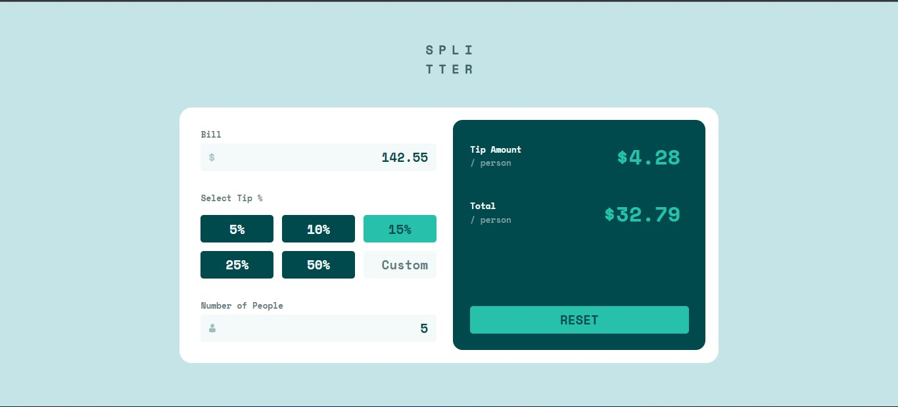

# frontend-mentor-challenge-20

frontend-mentor-challenge the link https://abubakr404.github.io/frontend-mentor-challenge-20/

# Frontend Mentor - Tip calculator app solution

This is a solution to the [Tip calculator app challenge on Frontend Mentor](https://www.frontendmentor.io/challenges/tip-calculator-app-ugJNGbJUX). Frontend Mentor challenges help you improve your coding skills by building realistic projects.

## Table of contents

- [Overview](#overview)
  - [The challenge](#the-challenge)
  - [Screenshot](#screenshot)
  - [Links](#links)
- [Author](#author)

## Overview

### The challenge

Users should be able to:

- See hover states for interactive elements

### Screenshot

### Links

- Live Site URL: [live site URL here](https://abubakr404.github.io/frontend-mentor-challenge-20/)

## Author

- Frontend Mentor - [@abubakr404](https://www.frontendmentor.io/profile/abubakr404)
